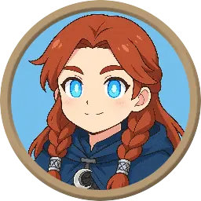
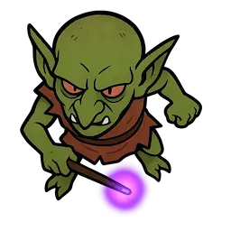

+++
title = "Token Builders"
slug = "token-builders"
created = 2025-09-03
tags = ["tools", "tokens"]
aliases = []
+++

A token is something that represents your character on a map. For play using a virtual tabletop, like one of the ones listed above, you will use a digital token. There are different styles of tokens. It can be something as simple as just a colored dot or an icon or something more photo-realistic that represents your character's image. It could even be a 3D model of your character. Typically, though, they come in one of two general styles:

Circle Tokens

Top Down Tokens

The circle tokens tend to be more common to represent player characters (PCs) as you can make them from any image you can find or create of the character.

There are a number of ways to create these tokens. There are typically two steps.

1. Find or create an image that matches the description of the character that you have in mind.
	- You can use a search engine, like Google Image search, to find something existing
	- Or, increasingly, use generative AI to create an image to your specification
2. Use a tool to add an appropriate border and background and create the circle token from your image.

This first group of tools allow you to upload an image and it will add the border and background. The extent that it lets you customize those borders and backgrounds is what differentiates the tools.

- https://rolladvantage.com/tokenstamp/
- https://heroictoken.com/
- https://thefatefulforce.com/battle-resources/token-creator/

## Character Avatar Builders

There is another group of tools that let you build your character image from scratch, typically by composing a collection of pre-built designs to arrive at your character concept. These tools may provide their own dedicated circle token export or may provide the regular image, which you can use with the tools above.

- [Hero Forge](https://www.heroforge.com) - create 3D models of your character. Quite customizable. Can be used to order 3D printed versions of your character design. 
- [Titan Craft](https://titancraft.com/) - another tool for creating custom 3D models of characters.
- [Eldritch Foundry](https://eldritch-foundry.com/) - create 3D characters for digital or printing use.
- [Anvl](https://anvl.co/) - more 3D character model building.
- [The Character Creator](https://charactercreator.org) - create custom 2D images of characters, choosing from various styles and body parts. Only human characters are supported.
- [Reroll](https://reroll.co/) - create pixel art versions of your characters.
- [Avatars in Pixels](https://www.avatarsinpixels.com/) - various styles of pixel avatars. Not as many ancestry options as dedicated TTRPG tools.

You should always check the licenses provided by these tools, as you may not be allowed to use your creations for commercial purposes. That's fine for private games, but it can have implications for people who want to stream their games, etc.

If you want premade tokens, those are available too. Check out the artists on the [[Assets]] page. They are more popular with Game Masters as they typically include monsters, beasts and other non-player characters (NPCs).
